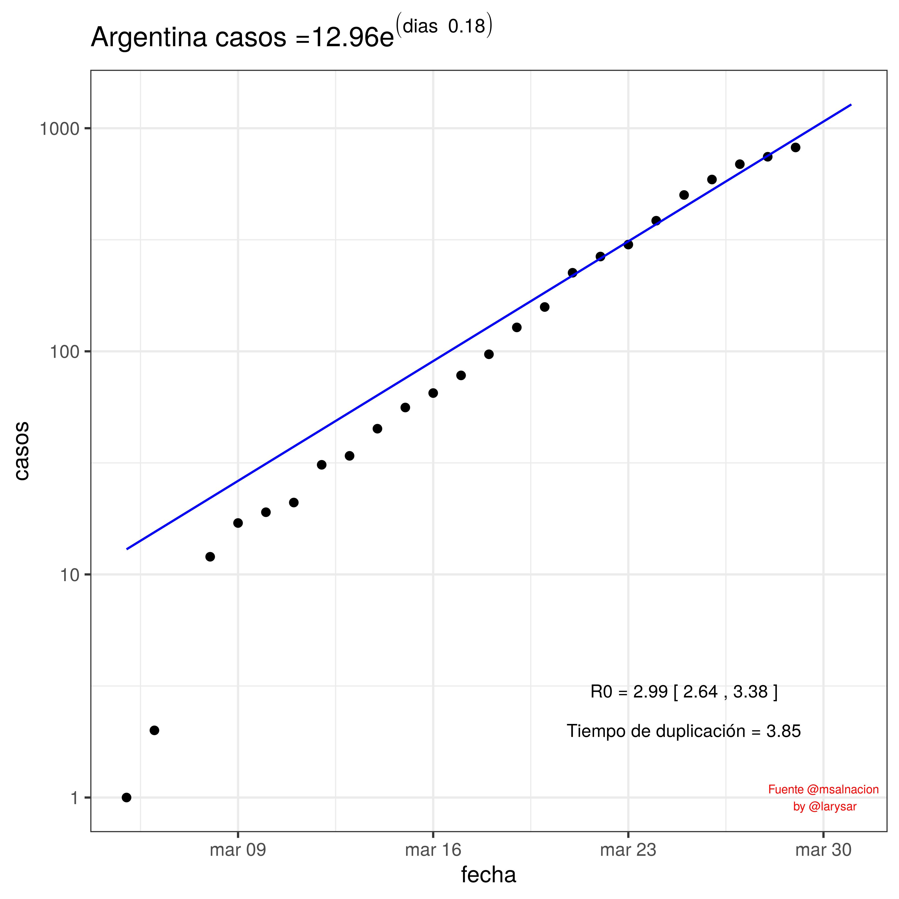
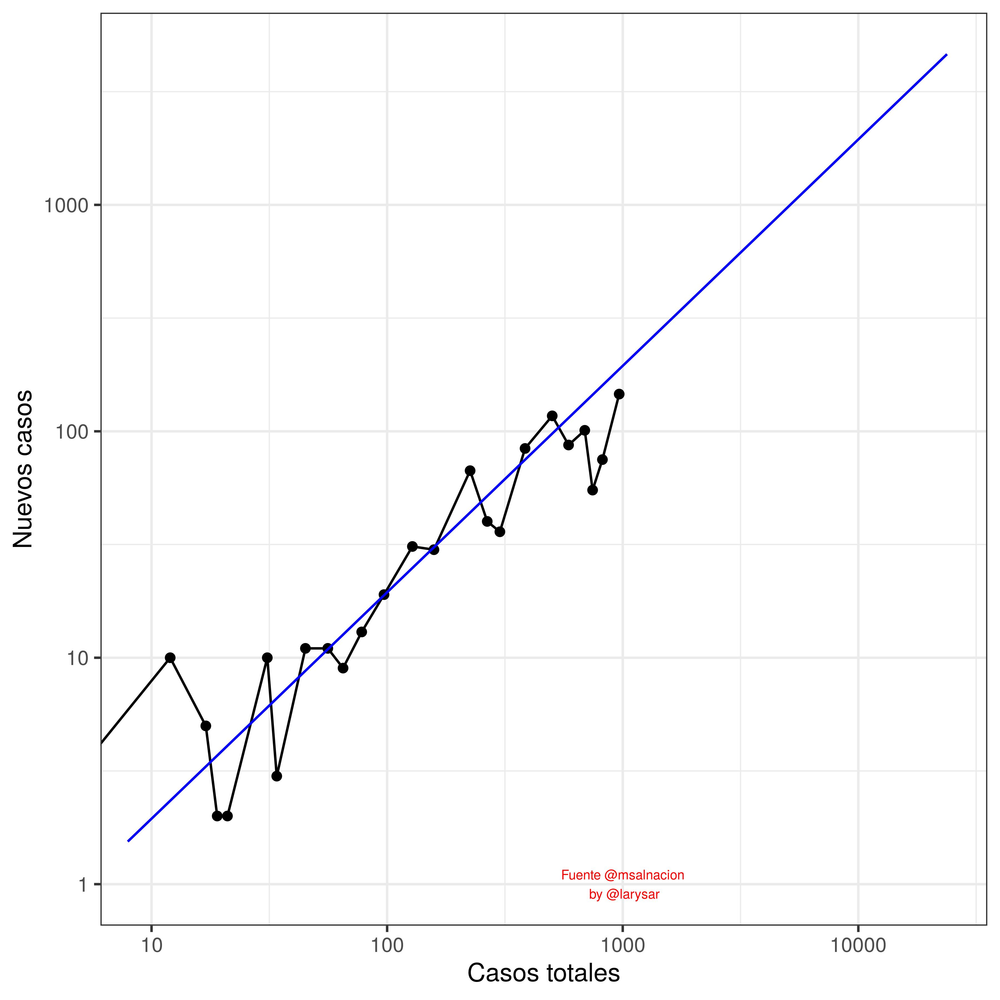
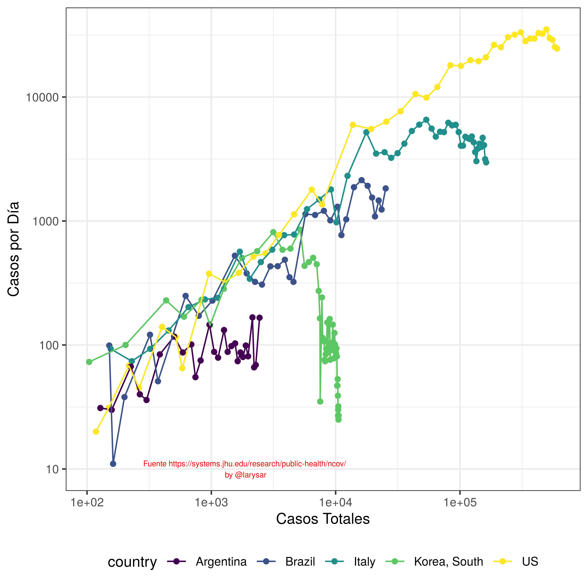

# Coronavirus - COVID19 - Argentina

- Datos de ministerio de salud <https://www.argentina.gob.ar/coronavirus/informe-diario> en archivo *coronavirus_ar.csv* 

	- Metadata: descripción de los campos

		- fecha: fecha del informe
		- casos: casos totales en argentina acumulados
		- casosdia: casos totales en argentina por día
		- fallecido: muertes acumuladas
		- CABA: casos en CABA acumulados
		- CABAdia: casos en CABA acumulados
		- recuperados: casos recuperados solo informados algunos dias, no siempre están en los reportes por lo son tomados de diversas fuentes.
		- contactos: casos por transmisión de contactos estrechos de casos importados, acumulados
		- comunitarios: casos referidos como en estudio epidemiológico o sospechoso de comunitarios, acumulados 
		- comunitariosdia: idem anterior por día NO ACUMULADOS
		- testeados: casos negativos por laboratorio
		- descartados: casos descartados por epidemiología
		- Observaciones

- [coronavirus.r](coronavirus.r) Código R para estimación de modelos de crecimiento exponencial y logístico. El R0 se calcula para la fase exponencial que termina el día 26/03/2020. El código usa un ajuste por cuadrados mínimos no-lineales y las funciones de los paquete *nls* y *drc* para los ajustes y *ggplot2/tidyverse* para gráficos y bases de datos.   

