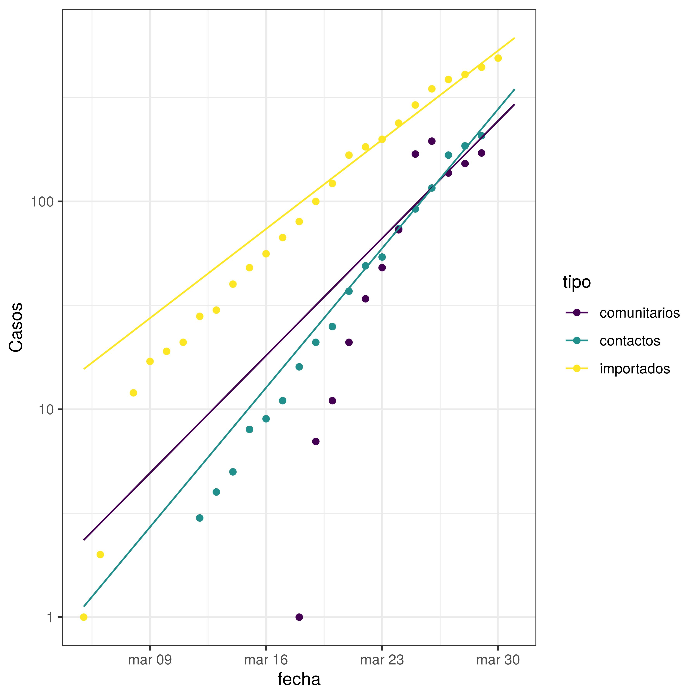
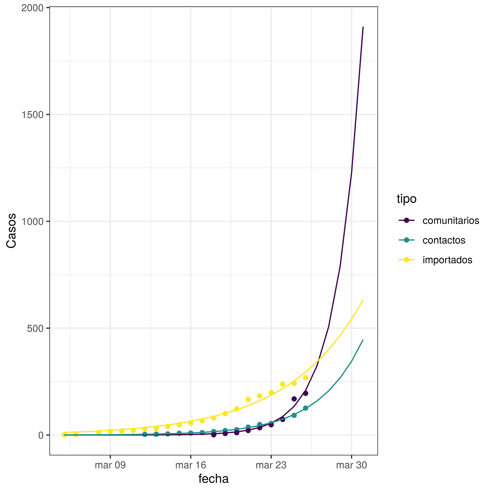

# Coronavirus - COVID19 - Argentina

- Datos de ministerio de salud <https://www.argentina.gob.ar/coronavirus/informe-diario> en archivo *coronavirus_ar.csv* 

	- Metadata: descripción de los campos

		- fecha: fecha del informe
		- casos: casos totales en argentina acumulados
		- fallecido: muertes acumuladas
		- CABA: casos en CABA acumulados
		- recuperados: casos recuperados no están informados en los reportes por lo son tomados de diversas fuentes por lo que no son confiables.
		- contactos: casos por transmisión de contactos estrechos de casos importados, acumulados
		- comunitarios: casos referidos como en estudio epidemiológico o sospechoso de comunitarios, NO ACUMULADOS! 

- [coronavirus.r](coronavirus.r) Código R para estimación de crecimiento, por ahora exponencial. El código usa un ajuste por cuadrados mínimos no-lineales y las funciones del paquete tidyverse para hacer ajustes por tipo.   

