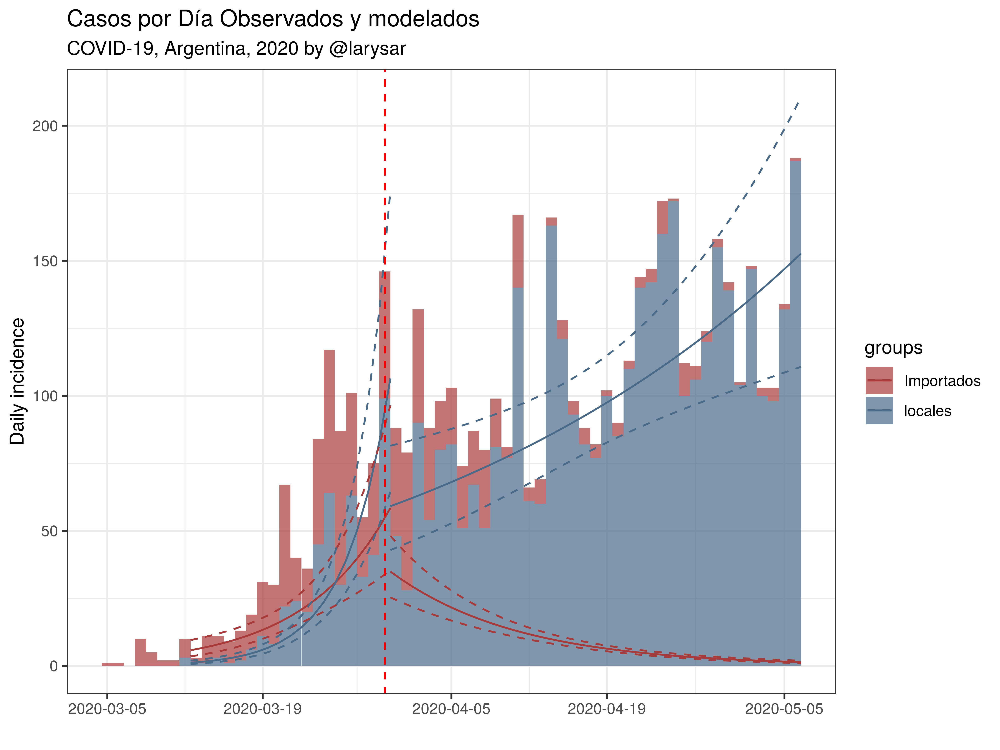
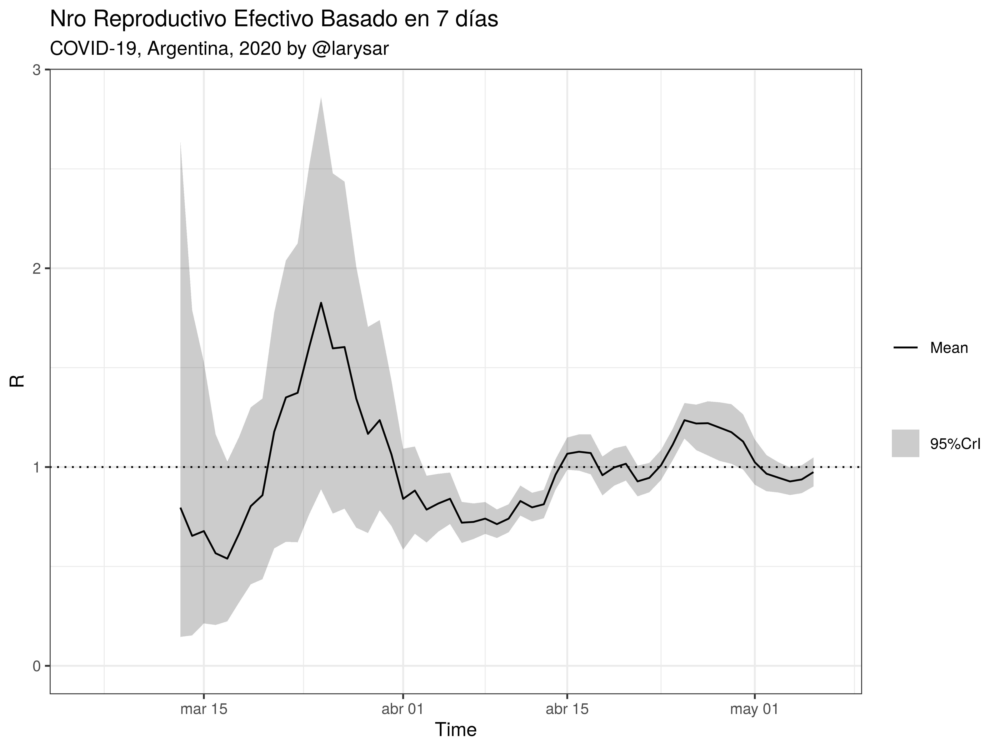
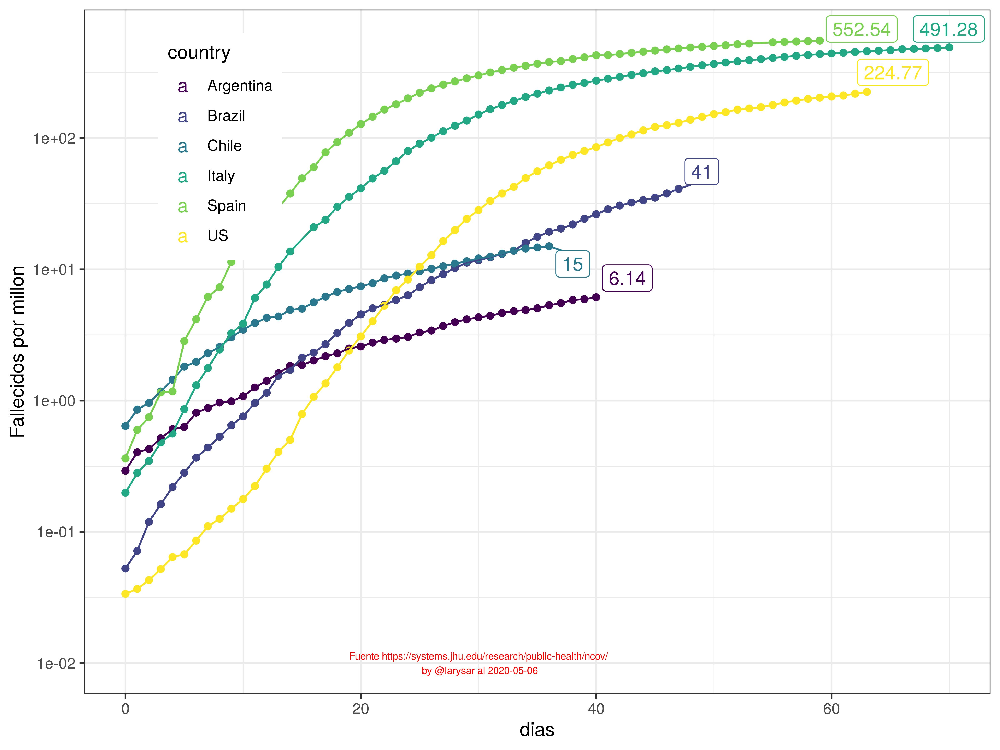
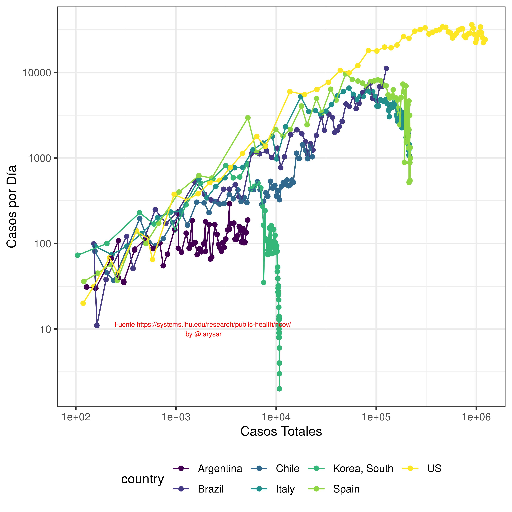

# Coronavirus - COVID19 - Argentina

- Datos de ministerio de salud <https://www.argentina.gob.ar/coronavirus/informe-diario> en archivo *coronavirus_ar.csv* 

	- Metadata: descripción de los campos

		- fecha: fecha del informe
		- casos: casos totales en argentina acumulados
		- casosdia: casos totales en argentina por día
		- fallecido: muertes acumuladas
		- CABA: casos en CABA acumulados
		- CABAdia: casos en CABA acumulados
		- recuperados: casos recuperados (dados de alta transitoria o permanente), inicialmente no siempre estaban en los reportes.
		- contactos: casos por transmisión de contactos estrechos de casos importados, acumulados
		- comunitarios: casos comunitarios 
		- investigacion: casos en investigacion epidemiológica, acumulados 
		- terapia: número de personas en terapia intensiva
		- testeados: total de casos testeados negativos por (laboratorio o epidemiologia)
		- descartados: total de casos descartados (casos totales + testeados)
		- Observaciones

- [Estima_cambios_Re.Rmd](Estima_cambios_Re.Rmd) Código R markdown para estimación del Número Reproductivo efectivo, tasa de crecimiento y decaimiento, tiempo de duplicacion y de reducción a la mitad, proyección de la fase de decaimiento. (Se inicio la cuarentena el 20/03/2020)

- [coronavirus_FallecidosPais.r](coronavirus_FallecidosPais.r) Código R para graficar los fallecidos comparando con otros países.

- [coronavirus.r](coronavirus.r) Código R para estimación de modelos de crecimiento exponencial y logístico. El R0 se calcula para la fase exponencial que termina el día 26/03/2020. El código usa un ajuste por cuadrados mínimos no-lineales y las funciones de los paquete *nls* y *drc* para los ajustes y *ggplot2/tidyverse* para gráficos y bases de datos.   

